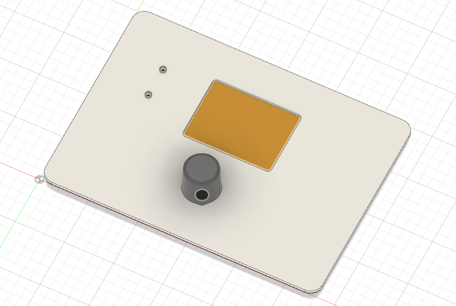
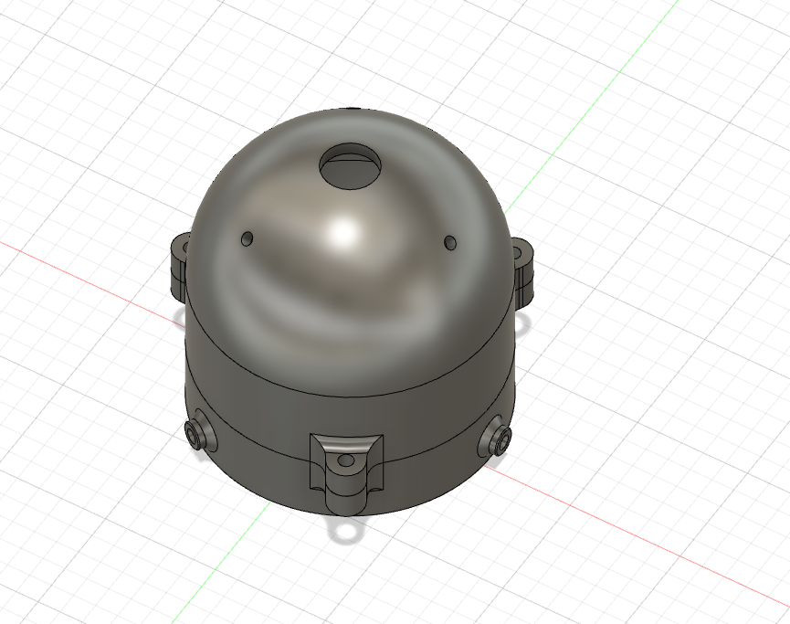
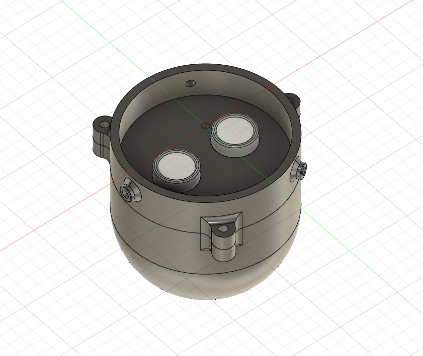

# **Oil Measurement** 

This repository hold project outputs from OilMeasurement project. Here you can find software releases, hardware schematics blocks and 3D models.

## **About**
OilMeasurement is a complete solution system for measuring oil in tank based on two independent methods:
 - **1st method: Based on oil burner working hours.** With knowledge of oil burner consuption factor and initial tank level system is able to accumulate consume oil. This method work only if initial oil level is correctly setup as it cannot define absolute consuption value but rather relative to the initial level. 

 - **2nd method: Based on actual measuring of oil level in tank.** For that method ultrasound transducier is used for measuring disatance from top of the tank to the oil surface. Based on that distace and with knowledge of oil tank geometry system is using advance mathematical techniques to calculate the absolute oil tank level. In contrast to 1st method this one is absolute in nature so no intial conditions are needed to be applied before it can be used.

## **Main Unit**

Main unit is reponsible for performing 1st method and for communication to sensor unit via CAN interface.

#### 3D model

##### Front panel

## **Sensor Unit**

Sensor unit is responsible for calcualtion of oil tank level and it interface with main unit in order to pass over results of measurements.

Used ultrasound module is HC-SR04.

#### 3D model

##### From top

##### From bottom
